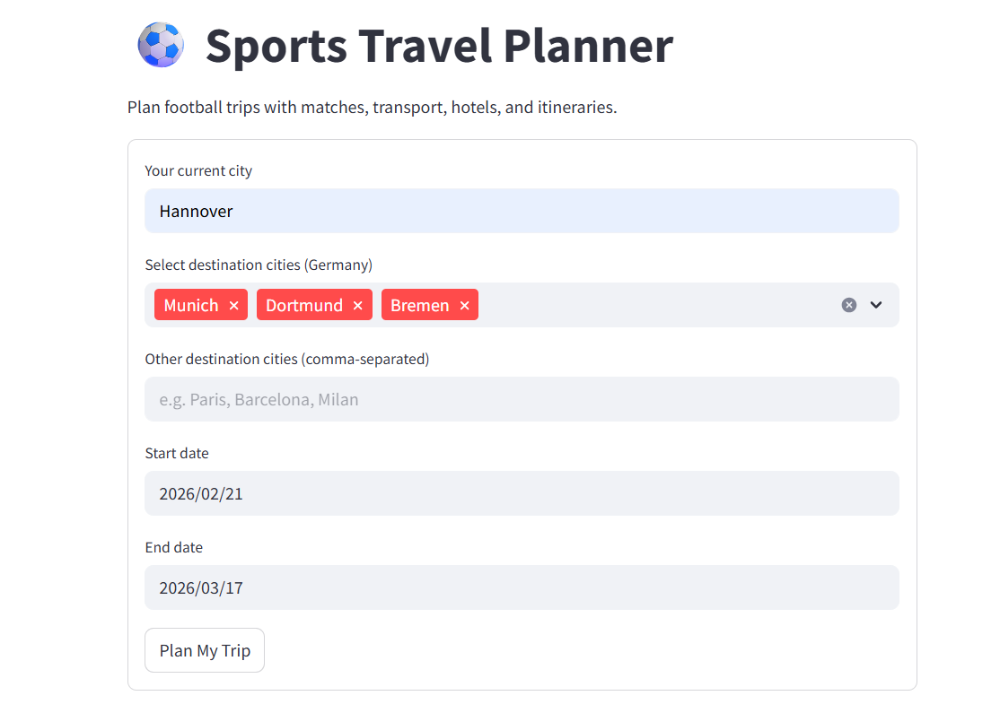

# SPORTS TRAVEL AGENT

An AI-powered sports travel planning system that helps users discover football matches, plan inter-city travel, find nearby hotels, and generate structured itineraries all through an intelligent, LLM workflow.

This project demonstrates how to design and deploy a production-ready AI agent backend using LangGraph, LangChain tools, FastAPI, and a Streamlit UI, with strict structured outputs suitable for real applications.

---

## 📌 Project Overview

The Sports Travel AI Agent takes a user’s starting location, destinations, and date range and automatically produces a complete football-focused travel plan, including:

- Matches available in selected cities

- Stadium details

- Train or bus travel options

- Hotel recommendations near stadiums

- Stadium transport tips

- A day-by-day itinerary

The system is designed as a backend-first AI service, where the user does not write prompts. Instead, user inputs are injected into a fixed system prompt, ensuring predictable, structured, and API-safe responses

---

## How it works
The application uses a LangGraph-based agent loop that allows the LLM to:

1. Decide when to call tools

2. Perform web searches via Tavily

3. Aggregate results

4. Return a strict JSON response following a predefined schema

The agent continues invoking tools until no further tool calls are required, then terminates automatically.

This approach avoids  single-shot prompting and mirrors how AI agents operate in real production systems.

### Agent Responsibilities

| Agent | Description |
|-----|------------|
| Research Agent | Uses Tavily API to retrieve real-time information e.g Live info, trending topics |
| Reasoning Agent | Generates final responses using Groq LLM e.g Recommendations, final answer|

Agents are dynamically created and orchestrated using LangChain-based logic.

**LangChain** is a framework for building applications powered by LLMs. It provides tools to manage prompts, models, memory, agents, and external tools in a structured way.

---

##  Tech Stack

### Backend
- **FastAPI** - Manages requests and agent orchestration
- **LangChain**
- **LangGraph** - Agent Workflow orchestration
- **OpenAI API** - Reasoning Engine
- **Tavily Search API** - Real-time web search

### Frontend
- **Streamlit**

### DevOps & Cloud Infrastructure
- **Docker**
- **Jenkins**
- **SonarQube**
- **AWS ECR**
- **AWS ECS Fargate**

---

## Core Design Decisions

- System-controlled prompting
Users never write prompts. Inputs are validated and injected into a fixed system instruction.

- Strict JSON outputs
The agent is constrained to return only valid JSON matching an explicit schema.

- Tool-first reasoning
The agent autonomously decides when to search for matches, transport, or stadium information.

- Separation of concerns
Business logic, agent orchestration, API, and UI are cleanly separated.

## Project Structure

- `app/frontend/ui.py` — Frontend application (Streamlit)
- `app/backend/api.py` — FastAPI to receive requests
- `app/main.py` — Main code which runs Frontend and Backend with the aid of threads
- `app/common/custom_exception.py` -  Returning detailed error
- `app/common/logger.py` - Logging actions
- `custom_jenkins/Dockerfile` - Jenkins container Dockerfile

---

## Getting Started

 **Local Development:**
   - Clone this repository.
   - Make sure to the `requirements.txt` file and install necessary libraries in order to run the app locally.
   - Enter the command `python -m app.main` and wait for webpage to load

---

## 🔄 Application Flow

1. User enters:

- Origin city
- Destination cities
- Start date
- End date

2. Streamlit UI sends structured data to FastAPI

3. Backend builds the system prompt

4. LangGraph agent runs tool loops

5. Final structured travel plan is returned as JSON

6. UI renders the itinerary

---

##  CI/CD Pipeline

The CI/CD pipeline is fully automated using Jenkins:

1. Code checkout from GitHub
2. Static code analysis with SonarQube
3. Docker image build
4. Image pushed to AWS Elastic Container Registry
5. Deployed to AWS ECS (Fargate)

Every push to main triggers a pipeline → builds → scans → deploys automatically.

     Stage             | Tool Used                               
     ----------------- | --------------------------------------- 
     Build, Test, Lint | Jenkins                                 
     Code Quality      | SonarQube                               
     Containerization  | Docker                                  
     Image Registry    | AWS ECR                                 
     Deployment        | AWS ECS Fargate (serverless containers) 

---

## ☁️ Deployment

- Jenkins runs inside Docker on AWS EC2
- Sonarqube runs as well inside Docker on AWS EC2
- Docker images pushed to AWS ECR
- Application deployed using **AWS ECS Fargate**

---

## What This Project Demonstrates

- Real agent-based AI (not chat completion demos)

- Tool-augmented reasoning with web search

- Structured AI outputs suitable for APIs

- Backend-driven prompt engineering

- Clean separation between UI, API, and AI logic

---

## Future Improvements

- Replace web search with direct transport APIs
- Expand to non-football sports
---

##  Author

**Tobi Segun Oluwategbe**  
AI / DevOps Engineer  
